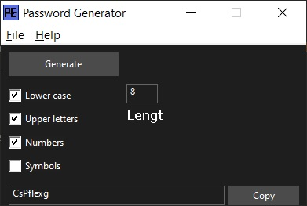

# Password Generator

## Image


*Picture 1: Game screenshot*

## Description

**Password Generator** is a simple Windows password generator with a graphical user interface. It allows you to generate passwords with various settings and copy them to the clipboard.

## Features

- Password generation using lowercase letters, uppercase letters, digits, and special symbols.
- Adjustable password length.
- Copy generated password to clipboard.
- System tray integration.

## Building

To build the project, you need [GCC](https://gcc.gnu.org/) and [MinGW](https://www.mingw-w64.org/downloads/) installed (if you are working on Windows).

1. **Install the required tools** (GCC and MinGW).

2. **Create the executable file**:

   Open a command prompt, navigate to the directory containing your source code and the `Makefile`. Run the following command:

   ```bash
   make
   ```

   This will build the project and create the executable `password_generator.exe`.

## Usage

1. **Run the application** `password_generator.exe`.

2. **Configure the password generation options** by checking the necessary checkboxes (lowercase letters, uppercase letters, digits, symbols).

3. **Specify the desired password length** in the corresponding field.

4. **Click the "Generate" button** to get a password.

5. **To copy the password** to the clipboard, click the "Copy" button.

6. **System tray display**:

   The application also appears in the system tray, where you can:
   - Restore the application window (right-click on the icon and select "Show").
   - Exit the application (right-click on the icon and select "Exit").

## Cleaning

To clean the built files, run the following command:

```bash
make clean
```

This will remove object files and the executable.

## Notes

- If you encounter compilation or runtime issues, make sure all dependencies are installed correctly.

## License

This project is open source and freely distributable under the **MIT** license. You may use and modify it according to your needs.

---

Developed by [Tailogs](https://github.com/tailogs).